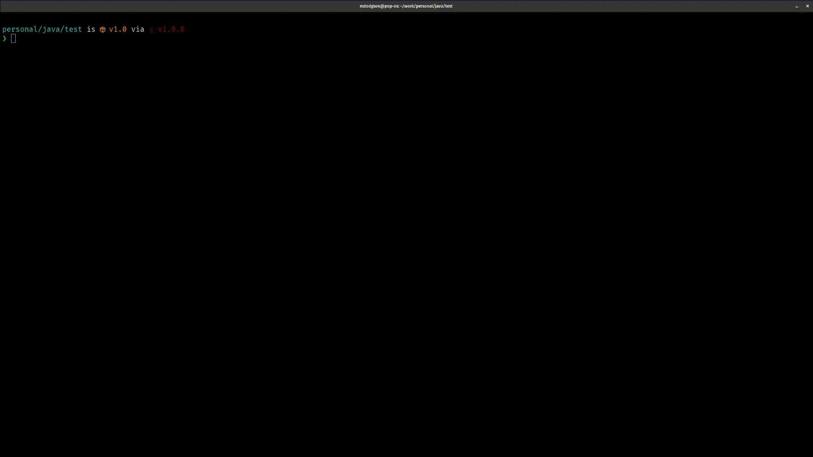
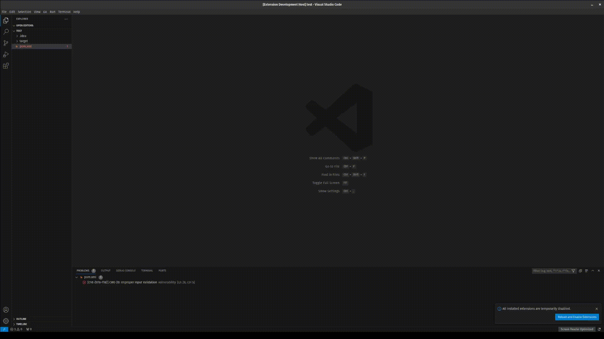
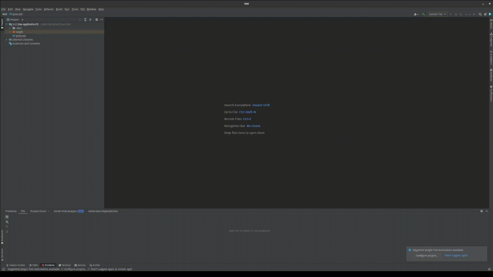

# Vulnerability Language Server Protocol

This is a simple language server for Sonatype vuln products.

Once built, ensure that the `vuln-lsp` binary is in your `$PATH`.

## Parameters

### Backend Service

The LSP can fetch data from either a `dummy` backend or from [OssIndex(https://ossindex.sonatype.org/)].
`dummy` is the default setting.
To enable OssIndex simply add the `oss-index` command line argument.

### Logging

To enable logging add the parameter `--log-level=<Leve>` to the command line
arguments where `<level>` is any of the following:

- `error`
- `warn`
- `info`
- `debug`
- `trace`


## Editors

### Neovim



To enable the lsp for neovim, add the following to your `init.lua`:

```lua
vim.api.nvim_create_autocmd("BufEnter", {
  pattern = "pom.xml",
  callback = function()
    vim.lsp.start({
      name = "vuln-lsp",
      cmd = { "vuln-lsp" },
      root_dir = vim.fs.dirname(vim.fs.find({ "pom.xml" }, { upward = true })[1]),
    })
  end,
})
```

This will start the lsp when you open a  `pom.xml`  file.

### Vscode


To build:

```bash
cd clients/vscode
npm install
```

To debug the lsp in vscode, first create a `launch.json` file in `.vscode/`
with the following contents:

```json
{
    "version": "0.2.0",
    "configurations": [
        {
            "type": "extensionHost",
            "request": "launch",
            "name": "Debug LSP Extension",
            "runtimeExecutable": "${execPath}",
            "env": {
                "RUST_LOG": "debug"
            },
            "args": [
              "--extensionDevelopmentPath=${workspaceRoot}/anathema-lsp/clients/vscode",
              "--disable-extensions",
              "${workspaceRoot}/anathema-lsp/"
            ]
          }
    ]
}

```

Run the debugger and open the provided `test.anat` file to test the lsp.

### Intellij

## Features
